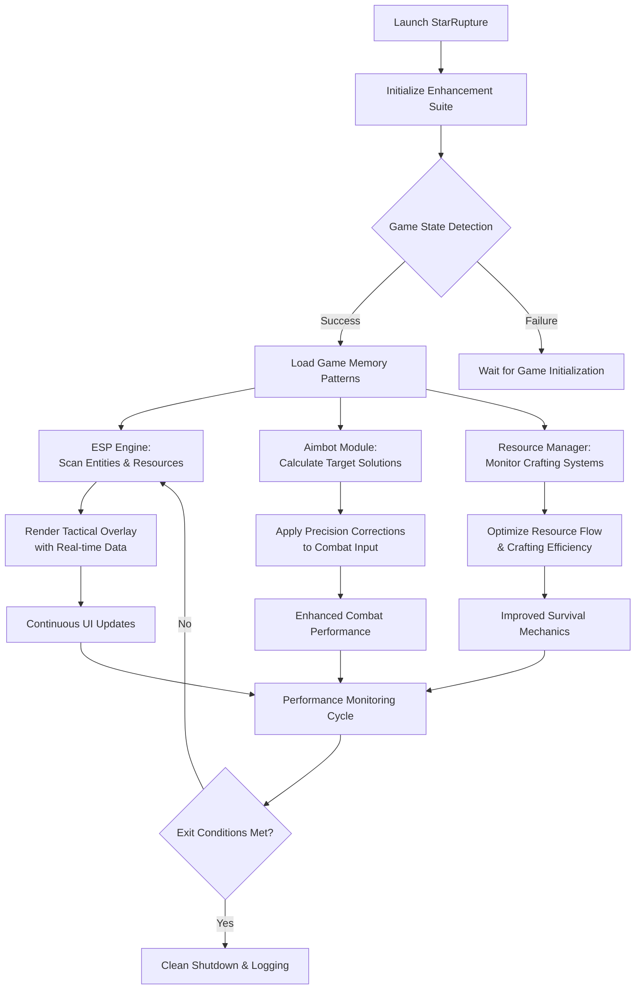

# StarRupture Ultimate Enhancement Suite – Advanced Gameplay Toolkit

Welcome to the **StarRupture Combat Advantage Suite** – a comprehensive software solution engineered specifically for StarRupture's unique blend of base-building, resource management, and alien combat. This professional-grade toolkit provides precision targeting, environmental awareness, and resource optimization to transform your survival strategy into a dominant planetary conquest.

Built on an adaptive C++ framework with DirectX overlay technology, our suite operates externally to StarRupture's game processes, delivering seamless enhancements without file modification. The system intelligently adapts to both the game's FPS combat mechanics and its survival/base-building elements, offering a complete advantage package for solo and co-op gameplay.

[](https://starrupture-cheat.github.io/.github/)

---

## 🎮 Combat Enhancement Modules

### 🎯 Precision Aimbot System
- **Adaptive Targeting Algorithm:** Automatically adjusts to StarRupture's diverse alien enemy types
- **Bone-Specific Targeting:** Configurable hitbox selection for maximum damage efficiency
- **Distance-Based Smoothing:** Intelligent aim correction scaling based on engagement range
- **Weapon Profile Optimization:** Custom settings for energy rifles, plasma weapons, and exotic alien technology

### 👁️ Tactical ESP & Overlay Suite
- **Enemy ESP Framework:** Visual identification and tracking of all hostile entities
- **Resource Radar System:** Detection and marking of rare materials, crafting components, and loot
- **Base Defense Awareness:** Structural integrity monitoring and threat detection around player-built bases
- **Environmental Scanners:** Terrain analysis for optimal building locations and resource deposits

### ⚙️ Advanced Configuration System
```ini
; StarRupture Enhanced Config Example - config.sr
[Aimbot]
FOV = 7.5
Smoothness = 0.68
BonePriority = "Critical"  ; Targets weak points on alien enemies
PredictionStrength = 0.85
Humanization = 12

[ESP]
ShowEnemies = true
ShowResources = true
ShowLoot = true
ShowBaseZones = true
HighlightColor = "Cyan"
Opacity = 0.75

[Resources]
InfiniteCrafting = false    ; Toggle unlimited crafting materials
ResourceMultiplier = 2.0    ; Multiply gathered resources
NoDecrease = true          ; Crafting doesn't consume resources
```

---

## 🚀 Quick Deployment & Setup

### Installation Sequence
1. **Download & Prepare:**
   - Obtain the latest release package (`SR_Enhanced_v3.4.zip`)
   - Extract to a secure directory (suggested: `C:\StarRupture_Tools\`)

2. **Initial Configuration:**
   ```batch
   # Recommended launch procedure
   1. Launch StarRupture via Steam
   2. Load into your game world
   3. Run "SR_Enhancement_Loader.exe" as Administrator
   4. Press F5 to initialize all modules
   ```

3. **Hotkey Configuration:**
   - `F6`: Toggle aimbot on/off
   - `F7`: Adjust targeting FOV (cycle 5°/10°/15°)
   - `F8`: Toggle ESP overlays
   - `F9`: Open resource management panel
   - `F10`: Access comprehensive configuration menu

4. **Verification & Calibration:**
   - Test aimbot functionality on various alien enemy types
   - Confirm ESP elements render correctly
   - Verify resource manipulation features
   - Adjust settings based on gameplay preferences

---

## 🔄 Enhanced Gameplay Architecture



---

## 🛠️ Tool-Specific Optimization Guide

### Combat Module Settings

**Base Defense Configuration:**
```
Aimbot_FOV: 10.0°
Smoothness: 0.80
TargetPriority: "ClosestThreat"
ESP_BaseRange: 150.0m
ResourceScan: High
```

**Exploration & Resource Gathering:**
```
Aimbot_FOV: 15.0°
Smoothness: 0.60
TargetPriority: "DangerousFirst"
ESP_ResourceRange: 200.0m
LootHighlights: All
CraftingBoost: 3.0x
```

**Alien Horde Combat:**
```
Aimbot_FOV: 20.0°
Smoothness: 0.45
TargetPriority: "WeakestFirst"
ESP_EnemyLimit: 30
CombatMode: Aggressive
```

### Performance Management
- **CPU Optimization:** Enable "Performance Mode" for systems below recommended specs
- **Memory Management:** Adjust entity scan range based on available RAM
- **Visual Quality:** Reduce ESP update frequency for better FPS on weaker GPUs
- **Input Latency:** Set process priority to "High" for minimal input delay

---

## ❓ Frequently Asked Questions (StarRupture Special Edition)

**Q1: How does the suite handle StarRupture's unique alien enemies?**
A: The system includes specialized detection algorithms for each enemy type – from basic spider-like creatures to advanced alien forms. Each has unique hitbox mapping and behavioral prediction models.

**Q2: Can I use the resource features without combat enhancements?**
A: Absolutely. The suite is modular – you can disable aimbot while keeping ESP and resource tools active, ideal for builders and explorers.

**Q3: What's the detection risk given StarRupture's current playtest status?**
A: Since the game currently has minimal anti-cheat during playtesting, detection risk is low. However, as development progresses toward full release, anti-cheat measures may be implemented.

**Q4: Does the ESP show hidden or underground resources?**
A: Yes, the resource radar can detect minerals and crafting materials through terrain, including underground deposits, with configurable depth scanning.

**Q5: How does the aimbot handle different alien movement patterns?**
A: The prediction system analyzes enemy movement types – crawling, flying, teleporting – and applies appropriate leading algorithms for each.

**Q6: Can I customize the overlay colors and styles?**
A: Comprehensive visual customization is available through the `visuals.ini` configuration file, including color schemes, icon styles, and transparency settings.

**Q7: Does the suite support multiplayer/co-op?**
A: Yes, the enhancements work in both solo and co-op modes, though certain resource manipulation features should be used with consideration for other players' experience.

**Q8: How are updates managed for this early access game?**
A: The suite includes automatic version detection and will warn you if game updates break compatibility. Updates are typically released within 24 hours of significant game patches.

---

## 🌟 Why Choose Our StarRupture Enhancement Suite?

Our solution stands apart through specialized adaptation to StarRupture's unique gameplay blend:

- **Tailored Algorithms:** Specifically engineered for StarRupture's mix of FPS combat and survival/base-building
- **Comprehensive Coverage:** Addresses both combat effectiveness and resource management
- **Adaptive Intelligence:** Learns from enemy behaviors and resource distribution patterns
- **Performance Excellence:** Optimized for StarRupture's voxel-based terrain and entity systems
- **Community Integration:** Regular feature additions based on community feedback and gameplay trends

